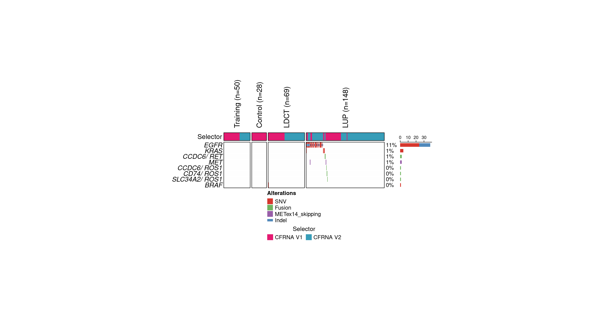

### Introduction

This tutorial provides a step-by-step guide to using the targeted variant caller, a key component of the RAREseq pipeline. The targeted variant caller is optimized for detecting mutations, indels, and gene fusions in RNA sequencing data generated by the RAREseq protocol. It uses a whitelist-based approach and requires specific input files such as a sample list, lane output directory, and whitelist files for mutations, indels, and gene fusions.

### Step 1: Install Required Dependencies

Ensure the following dependencies are installed before proceeding:

#### R Dependencies:
- ComplexHeatmap
- RColorBrewer
- circlize
- ggplot2
- cowplot

#### Python Dependencies:
- Python 3
- bedtools
- samtools
- numpy
- pandas
- scipy

### Step 2: Download the Code

Download the targeted variant caller code into your local directory.

### Step 3: Prepare Input Files

The following input files are necessary to run the targeted variant caller. Example files are provided in the `example_input` directory.

#### **Input Files**

1. **Sample List File (-i | --input_sample_list):**
   A tab-delimited file listing the samples to analyze. It must include:
   - **Lane:** The sequencing lane.
   - **ID:** The sample identifier.

```{r}
sample_list_file <- read.table("example_input/sample_list.txt", sep="\t", header=TRUE)
head(sample_list_file, 5)[,1:5]
```

2. **Lane Outputs Directory (-l | --lane_path):**
   Directory containing the RAREseq lane outputs.

3. **Mutation/Indel Whitelist File (-wm | --whitelist_mutation_indel):**
   A tab-delimited file specifying mutations and indels. It must include:
   - **CHR:** Chromosome
   - **START:** Start position
   - **END:** End position (same as start for point mutations)
   - **REF:** Reference allele
   - **VAR:** Variant allele (use "-" for deletions and "+" for insertions)
   - **GENE:** Gene name

```{r}
whitelist_mutation_indel_file <- read.table("targeted-caller/NCCN_SNV_indel.txt", sep="\t", header=TRUE)
head(whitelist_mutation_indel_file, 5)
```

4. **Gene Fusion Whitelist File (-wf | --whitelist_fusion):**
   A tab-delimited file specifying gene fusions, including:
   - Partner gene symbols

```{r}
whitelist_fusion_file <- read.table("targeted-caller/NCCN_fusions.txt", sep="\t", header=TRUE)
head(whitelist_fusion_file, 5)
```

5. **Output Directory (-o | --output_path):**
   Specify the directory for the output files.

6. **Genome File (-g | --genome, optional):**
   Path to the genome reference file.

7. **Background Samples (-b | --background_samples, optional):**
   Specifies how to select control samples for background estimation. It can be:
   - An integer indicating the number of unique control donors to randomly select.
   - A file containing a subset of rows from the sample list.

8. **Bedtools Command (-bt | --bedtools_command, optional):**
   Path to the `bedtools` executable.

9. **Seed (-s | --seed, optional):**
   Random seed value (default: 1234).

### Step 4: Execute the Targeted Variant Caller

#### Stage 1: Parse Lane Outputs

This stage extracts relevant data from the raw lane outputs. Use the following command:

```{sh, eval = F}
python3 parse-lane-outputs.py \
    -i "example_input/sample_list.txt" \
    -b "example_input/control_list.txt" \
    -l <path to the folder containing the raw lane outputs> \
    -wm targeted-caller/NCCN_SNV_indel.txt \
    -wf targeted-caller/NCCN_fusions.txt \
    -o example_input \
    -s 1234 \
    -g <path to genome reference .fa file> \
    -bt bedtools \
    $@
```

This command generates a `parsed_lane_output` subdirectory within the output folder, containing inputs for the next stage.

#### Stage 2: Run Variant Calling

Use the parsed lane outputs from Stage 1 to execute the targeted variant caller:

```{sh, eval = F}
python3 main-script-targeted-caller.py \
  -i "example_input/sample_list.txt" \
  -b "example_input/control_list.txt" \
  -p "example_input/parsed_lane_output" \
  -wm targeted-caller/NCCN_SNV_indel.txt \
  -wf targeted-caller/NCCN_fusions.txt \
  -o example_output \
  -s 1234 \
  -g <path to genome reference .fa file> \
  -bt bedtools \
  $@
```

### Step 5: Interpret the Output

The output folder (`example_output`) contains several key files:

1. **variant_call_table.txt:** A table summarizing the variant calls.

```{r}
stats_file <- read.table("example_output/variant_call_table.txt", sep="\t", header=TRUE)
head(stats_file, 5)
```

2. **oncoprint.pdf / oncoprint.png:** Oncoprint visualizations of the detected variants.

```{r}

```

