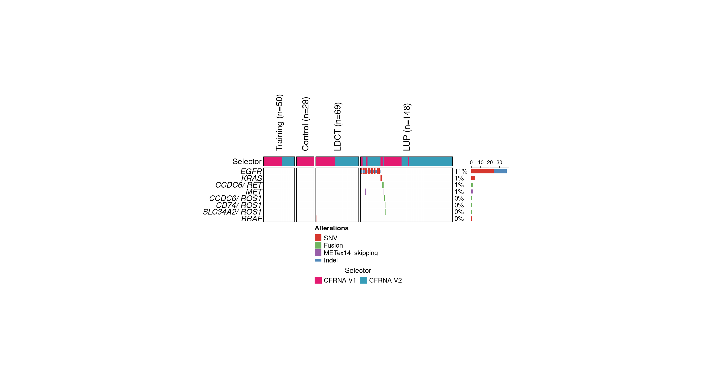

### Introduction

This tutorial provides a step-by-step guide to using the targeted
variant caller, a key component of the RAREseq pipeline. The targeted
variant caller is optimized for detecting mutations, indels, and gene
fusions in RNA sequencing data generated by the RAREseq protocol. It
uses a whitelist-based approach and requires specific input files such
as a sample list, lane output directory, and whitelist files for
mutations, indels, and gene fusions.

### Step 1: Install Required Dependencies

Ensure the following dependencies are installed before proceeding:

#### R Dependencies:

-   ComplexHeatmap
-   RColorBrewer
-   circlize
-   ggplot2
-   cowplot

#### Python Dependencies:

-   Python 3
-   bedtools
-   samtools
-   numpy
-   pandas
-   scipy

### Step 2: Download the Code

Download the targeted variant caller code into your local directory.

### Step 3: Prepare Input Files

The following input files are necessary to run the targeted variant
caller. Example files are provided in the `example_input` directory.

#### **Input Files**

1.  **Sample List File (-i | –input\_sample\_list):** A tab-delimited
    file listing the samples to analyze. It must include:
    -   **Lane:** The sequencing lane.
    -   **ID:** The sample identifier.

<!-- -->

    sample_list_file <- read.table("example_input/sample_list.txt", sep="\t", header=TRUE)
    head(sample_list_file, 5)[,1:5]

    ##         Lane              SequencingID        LibID              ID
    ## 1  HiSeq1735 Sample_CTR104.C5.C1_cfrna CTR104.C5.C1 CTR104.C5.C1.V1
    ## 2 NovaSeq209 Sample_CTR104.C5.C1_cfrna CTR104.C5.C1 CTR104.C5.C1.V2
    ## 3  HiSeq1605 Sample_CTR116.C2.C1_cfrna CTR116.C2.C1 CTR116.C2.C1.V1
    ## 4  HiSeq1574 Sample_CTR130.C2.C3_cfrna CTR130.C2.C3 CTR130.C2.C3.V1
    ## 5 NovaSeq209 Sample_CTR130.C2.C3_cfrna CTR130.C2.C3 CTR130.C2.C3.V2
    ##             Barcode
    ## 1 AGGACATT-AGGACATT
    ## 2 AGGACATT-AGGACATT
    ## 3 CTAGTAGC-CTAGTAGC
    ## 4 ATAGCTAG-ATAGCTAG
    ## 5 ATAGCTAG-ATAGCTAG

1.  **Lane Outputs Directory (-l | –lane\_path):** Directory containing
    the RAREseq lane outputs.

2.  **Mutation/Indel Whitelist File (-wm |
    –whitelist\_mutation\_indel):** A tab-delimited file specifying
    mutations and indels. It must include:

    -   **CHR:** Chromosome
    -   **START:** Start position
    -   **END:** End position (same as start for point mutations)
    -   **REF:** Reference allele
    -   **VAR:** Variant allele (use “-” for deletions and “+” for
        insertions)
    -   **GENE:** Gene name

<!-- -->

    whitelist_mutation_indel_file <- read.table("targeted-caller/NCCN_SNV_indel.txt", sep="\t", header=TRUE)
    head(whitelist_mutation_indel_file, 5)

    ##    CHR    START      END REF VAR GENE  CNT STRAND       CDS      AA   COSMIC
    ## 1 chr7 55259515 55259515   T   G EGFR 2111      + c.2573T>G p.L858R COSM6224
    ## 2 chr7 55259524 55259524   T   A EGFR   80      + c.2582T>A p.L861Q COSM6213
    ## 3 chr7 55249005 55249005   G   T EGFR   na      + c.2303G>T p.S768I COSM6241
    ## 4 chr7 55241707 55241707   G   A EGFR   na      + c.2155G>A p.G719S COSM6252
    ## 5 chr7 55241708 55241708   G   C EGFR   na      + c.2156G>C p.G719A COSM6239

1.  **Gene Fusion Whitelist File (-wf | –whitelist\_fusion):** A
    tab-delimited file specifying gene fusions, including:
    -   Partner gene symbols

<!-- -->

    whitelist_fusion_file <- read.table("targeted-caller/NCCN_fusions.txt", sep="\t", header=TRUE)
    head(whitelist_fusion_file, 5)

    ##   GENE1  GENE2     Source Count
    ## 1   ALK   EML4 cbioportal   238
    ## 2   ALK  KIF5B cbioportal     5
    ## 3   ALK SQSTM1 cbioportal     3
    ## 4   ALK   STRN cbioportal     3
    ## 5   ALK  ZFPM2 cbioportal     3

1.  **Output Directory (-o | –output\_path):** Specify the directory for
    the output files.

2.  **Genome File (-g | –genome, optional):** Path to the genome
    reference file.

3.  **Background Samples (-b | –background\_samples, optional):**
    Specifies how to select control samples for background estimation.
    It can be:

    -   An integer indicating the number of unique control donors to
        randomly select.
    -   A file containing a subset of rows from the sample list.

4.  **Bedtools Command (-bt | –bedtools\_command, optional):** Path to
    the `bedtools` executable.

5.  **Seed (-s | –seed, optional):** Random seed value (default: 1234).

### Step 4: Execute the Targeted Variant Caller

#### Stage 1: Parse Lane Outputs

This stage extracts relevant data from the raw lane outputs. Use the
following command:

    python3 parse-lane-outputs.py \
        -i "example_input/sample_list.txt" \
        -b "example_input/control_list.txt" \
        -l <path to the folder containing the raw lane outputs> \
        -wm targeted-caller/NCCN_SNV_indel.txt \
        -wf targeted-caller/NCCN_fusions.txt \
        -o example_input \
        -s 1234 \
        -g <path to genome reference .fa file> \
        -bt bedtools \
        $@

This command generates a `parsed_lane_output` subdirectory within the
output folder, containing inputs for the next stage.

#### Stage 2: Run Variant Calling

Use the parsed lane outputs from Stage 1 to execute the targeted variant
caller:

    python3 main-script-targeted-caller.py \
      -i "example_input/sample_list.txt" \
      -b "example_input/control_list.txt" \
      -p "example_input/parsed_lane_output" \
      -wm targeted-caller/NCCN_SNV_indel.txt \
      -wf targeted-caller/NCCN_fusions.txt \
      -o example_output \
      -s 1234 \
      -g <path to genome reference .fa file> \
      -bt bedtools \
      $@

### Step 5: Interpret the Output

The output folder (`example_output`) contains several key files:

1.  **variant\_call\_table.txt:** A table summarizing the variant calls.

<!-- -->

    stats_file <- read.table("example_output/variant_call_table.txt", sep="\t", header=TRUE)
    head(stats_file, 5)

    ##     CHR      POS REF VAR DEPTH NR GENE         PROB P_NR TYPE  BKG_MAX_AF
    ## 1 chr12 25380275   T   A   464  0 KRAS 0.0001004267    1  SNV 0.001461988
    ## 2 chr12 25380275   T   A  1178  0 KRAS 0.0001004267    1  SNV 0.001461988
    ## 3 chr12 25380275   T   A   670  0 KRAS 0.0001004267    1  SNV 0.001461988
    ## 4 chr12 25380275   T   A  1415  0 KRAS 0.0001004267    1  SNV 0.001461988
    ## 5 chr12 25380275   T   A   775  0 KRAS 0.0001004267    1  SNV 0.001461988
    ##         Lane              ID SampleType Selector AF CallType Q Called
    ## 1  HiSeq1735 CTR104.C5.C1.V1   Training CFRNA V1  0      SNV 1  FALSE
    ## 2 NovaSeq209 CTR104.C5.C1.V2   Training CFRNA V2  0      SNV 1  FALSE
    ## 3  HiSeq1605 CTR116.C2.C1.V1    Control CFRNA V1  0      SNV 1  FALSE
    ## 4  HiSeq1575 CTR131.C2.C3.V1    Control CFRNA V1  0      SNV 1  FALSE
    ## 5  HiSeq1575 CTR132.C4.C1.V1   Training CFRNA V1  0      SNV 1  FALSE

1.  **oncoprint.pdf / oncoprint.png:** Oncoprint visualizations of the
    detected variants.

<!-- -->

    

